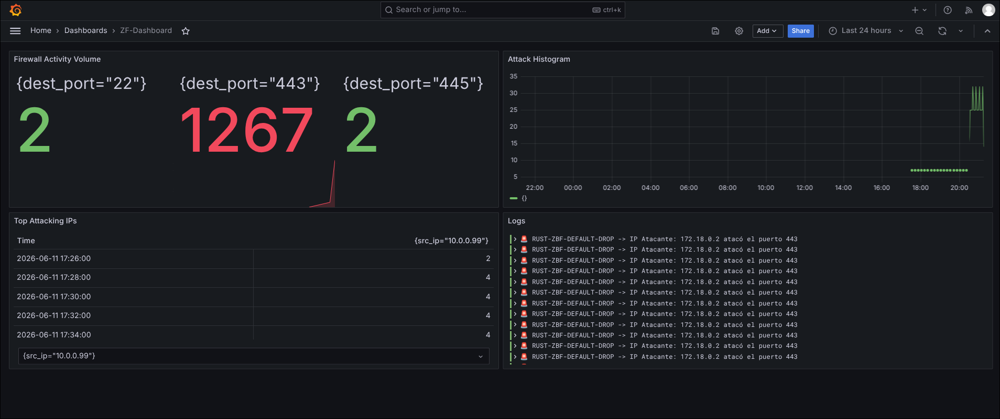

# Zone-Based Firewall & SIEM Observability Stack

A high-performance, Zone-Based Firewall (ZBF) developed in **Rust** that directly manipulates Linux Netfilter (`nftables`). It features an automated security logging pipeline integrated with a modern cloud-native observability stack (**Loki**, **Promtail**, and **Grafana**) running inside Docker for real-time threat detection and SIEM-like visual analysis.

## Dashboard Preview
*Here goes the screenshot of your main Grafana Dashboard showing the attacks, ports, and logs.*


---

## Architecture Overview

The system operates as a reactive pipeline distributed into two main layers: Kernel/Network Security and SIEM Analytics.

1. **Rust Firewall Engine**: Reads network topology constraints from a JSON file, securely checks for root privileges, and compiles firewall zone states atomically straight into the Linux kernel via `nftables` input streams.
2. **Ulogd2 Logging Daemon**: Intercepts high-performance `NFLOG` native netfilter groups and maps raw connection drops into standard structured JSON log entries.
3. **Promtail**: Ships and labels raw json entries matching target daemon rulesets.
4. **Grafana Loki**: Efficiently indexes aggregated multi-tenant forensic logs.
5. **Grafana Server**: Renders structural analytical panels representing active security event distributions.

---

## Repository Structure

```text
rust-zone-firewall-siem/
├── src/                    # Rust core source codebase
│   └── main.rs             # System boundaries enforcement logic
├── configs/                # System daemon configurations
│   ├── ulogd.conf          # Netfilter JSON logger ruleset
│   └── setup-zones.sh      # Baseline network namespace provisioning script
├── deployment/             # Containerized analytics orchestration
│   ├── docker-compose.yml  # Observability server infrastructure definition
│   ├── promtail-config.yml # Pipeline mapping rules for Loki shipping
│   └── loki-config.yml     # Distributed data storage retention settings
├── dashboards/             # Visual state layouts
│   └── zf-dashboard.json   # Exported production Grafana dashboard manifest
├── Cargo.toml              # Rust dependency metadata manifest
└── README.md               # System architectural documentation
```

---

## Quick-Start Implementation

To quickly test the end-to-end integration without compiling Rust manually, follow these core configuration steps:

### 1. Provision Network Zones & Ruleset
Ensure your Linux bridge or network interfaces match your topology, then invoke the core execution rules to load `nftables`:

```bash
# Verify netfilter ruleset ingestion
sudo nft -f - <<EOF
table inet zbf_infra {
    set z_wan { type ifname; elements = { "eth0" } }
    chain forward {
        type filter hook forward priority filter; policy drop;
        ct state established,related accept
        iifname @z_wan tcp dport { 22, 443, 445 } log group 1 prefix "RUST-ZBF-BLOCK" drop
        log group 1 prefix "RUST-ZBF-DEFAULT-DROP" drop
    }
}
EOF
```

### 2. Verify Structured Logging (Forensics)
Your `ulogd2` daemon will catch the kernel dumps and append them into raw JSON signatures. You can track real-time drops on your host system terminal:

```bash
tail -f /var/log/ulogd_firewall.json | jq .
```

### 3. Import and Run the Analytical State
Once the Docker stack is active via `docker-compose up -d`, navigate to `http://localhost:3000`:
1. Go to **Connections** -> **Data Sources** and add **Loki** (`http://loki:3100`).
2. Go to **Dashboards** -> **New** -> **Import**.
3. Upload the `dashboards/zf-dashboard.json` file to instantly spawn your visual security controls.

---

## Getting Started & Deployment

### 1. Prerequisites
Ensure you are running a Linux Kernel supporting `nftables` (e.g., Arch Linux) with Docker and `ulogd2` installed.

### 2. Configure System Logging
Copy the provided configurations to your system run path:

```bash
sudo cp configs/ulogd.conf /etc/ulogd.conf
sudo systemctl restart ulogd
```

### 3. Spin Up the SIEM Infrastructure
Launch the Prometheus/Loki/Grafana aggregation nodes in detached mode:

```bash
cd deployment
docker-compose up -d
```

### 4. Compile and Launch the Firewall Engine
Navigate back to the workspace root and run the execution binary under root permissions to load the rule chains:

```bash
sudo cargo run --release
```

---

## Security Metrics & SIEM Panels Included

- **Total Security Events**: A macro totalizer computing aggregate anomalies filtered across the entire system runtime.
- **Firewall Activity Volume by Port**: Granular metric mapping live threats targeting key vectors such as **Port 22 (SSH)**, **Port 443 (HTTPS)**, and **Port 445 (SMB)**.
- **Top Attacking IPs**: An instantly calculated real-time block list displaying infrastructure origin endpoints matching automated drop rules.
- **Live Threat Logs**: A continuous text feed capturing context descriptors enriched directly with emojis (`🚨`) indicating drop signatures like `RUST-ZBF-DEFAULT-DROP`.
